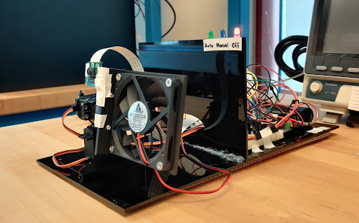
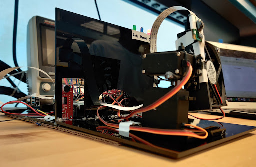
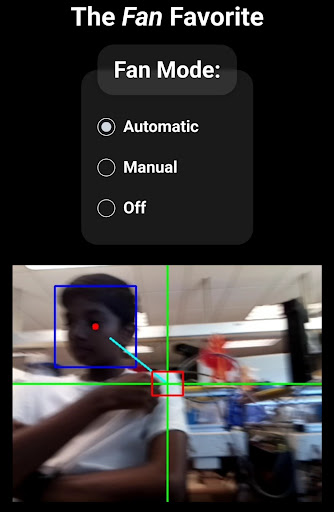
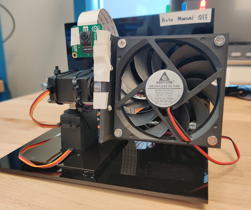
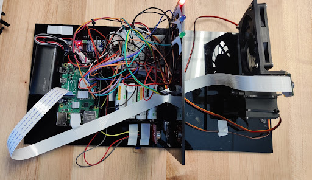

# The Fan Favorite

## Key Concepts

- We used OpenCV cascade models to detect faces, and then trig a PID controller to calculate the angle to the face and update our two servos accordingly.
- We used a sound sensor to detect claps to toggle the fan on and off.
- We used LEDs to indicate the state of the fan.
- We used Flask, HTML, CSS, and JavaScript to make an interactive website to control the fan and view the camera.

## Hardware

- Raspberry Pi
- PWM driver
- Motor driver
- MCP3008 ADC
- Sparkfun sound detector
- Pi Camera
- LEDs
- Two 180° servos
- 5V Fan

## Software

- P(i)D
- OpenCV2
- Face detection
- Trig
- Finite State Machine
- Flask Server

## Pictures

